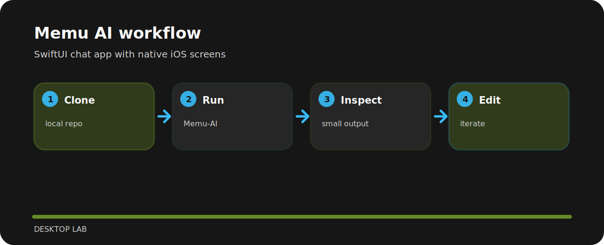

# Memu AI


SwiftUI chat app with native iOS screens.

## Project route



## Local start

```bash
git clone https://github.com/mertefekurt/Memu-AI.git
cd Memu-AI
Memu-AI
```

## What matters

- Designed as a focused desktop lab repo.
- Keeps setup short.
- Prioritizes readable output over infrastructure.

## File path

```text
Documentation/   screenshots and notes
Memu/            project file
Memu.xcodeproj/  project file
MemuTests/       project file
MemuUITests/     project file
```
