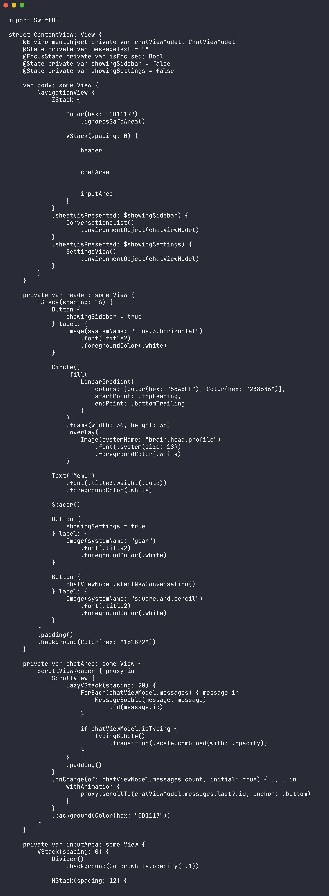

# Memu AI

<div align="center">


</div>

Memu AI is an iOS chat assistant built with SwiftUI. It focuses on a clean chat experience, conversation management, configurable settings, and native iOS interaction patterns.



## Screenshots

| Chat | Conversations | Settings |
| --- | --- | --- |
|  |  |  |

## Features

- SwiftUI-first chat interface
- Conversation list and message history screens
- Settings area for app configuration
- Native iOS project structure with unit and UI tests
- App icon and visual assets included
- Lightweight project that is easy to open in Xcode

## Quick Start

```bash
git clone https://github.com/mertefekurt/Memu-AI.git
cd Memu-AI
open Memu.xcodeproj
```

Then select an iOS simulator or device in Xcode and run the `Memu` scheme.

## Project Structure

```text
Memu/
  MemuApp.swift              App entry point
  ContentView.swift          Main SwiftUI interface
  Assets.xcassets/           App icon, accent color, and assets
Documentation/Images/        App screenshots
MemuTests/                   Unit tests
MemuUITests/                 UI tests
Memu.xcodeproj/              Xcode project
```

## Requirements

| Tool | Version |
| --- | --- |
| Xcode | 15 or newer recommended |
| iOS | 17.0 or newer |
| Swift | 5.9 or newer |
